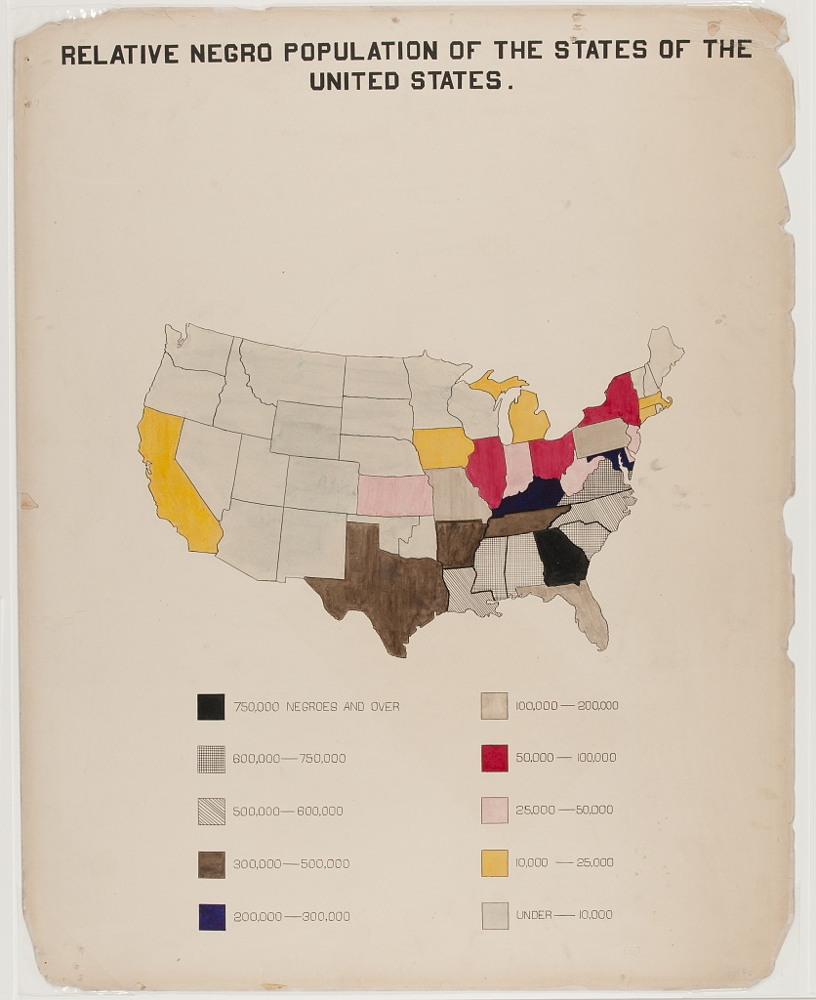
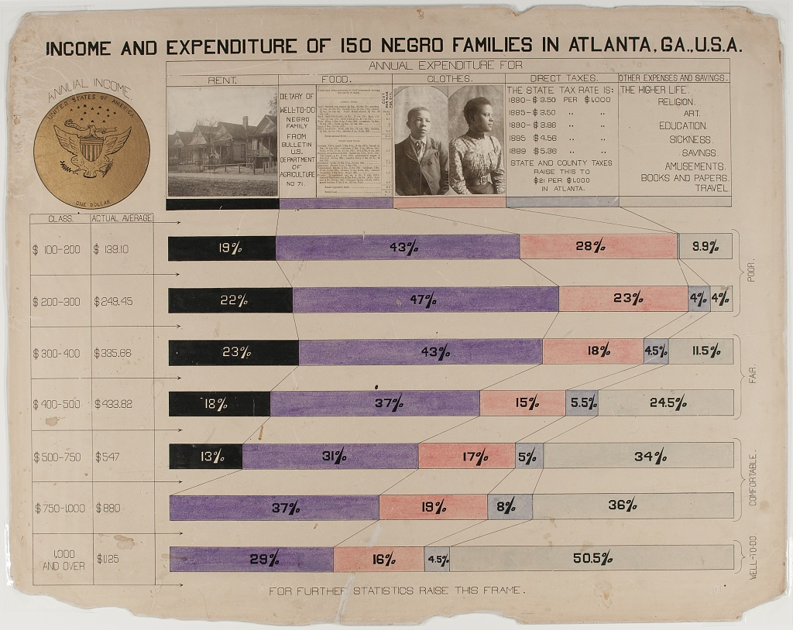
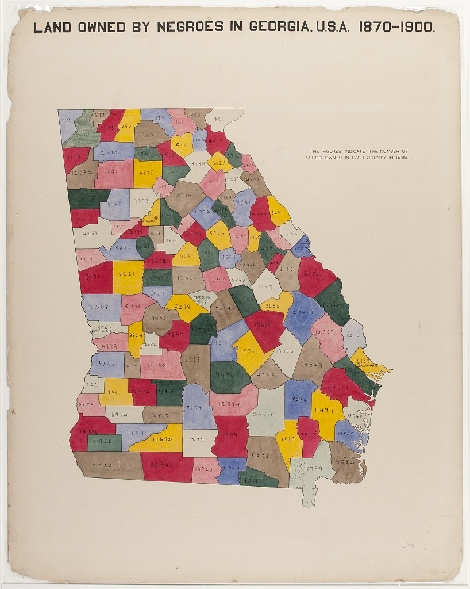
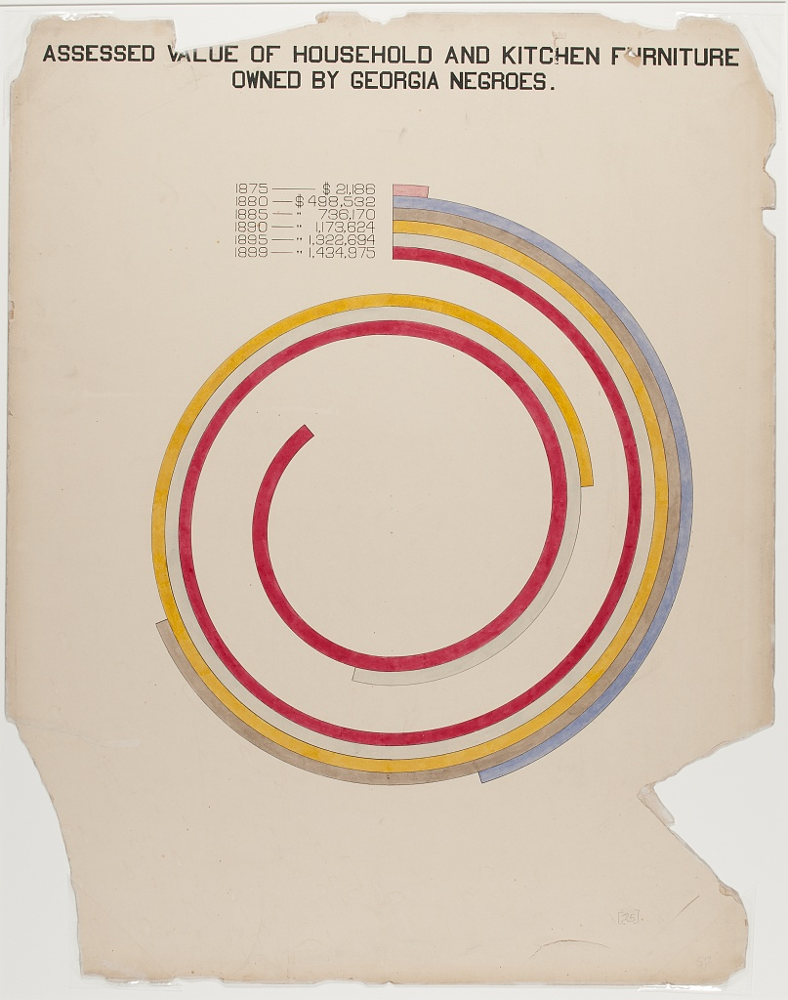

# Why Visualize Data: Creative and Visual Thinking in the Case of Du Bois

Academic and professional undertakings often present us with questions that are hard to answer with words alone. Creativity is often valuable for answering the hardest questions, including scientific ones. And visualization of concepts and data can be an important creative tool for formulating and answering questions. Because science and most professions involve collective undertakings, you will also need to communicate your ideas and analysis to others. Visualizations can again be a powerful creative tool towards this end. Cascades of mind numbing data will often lose your audience and collaborators. 

Recent scholarship (Conwell and Loughren 2024; Itzigsohn and Brown 2020; Morris 2017) and social media initiatives (Starks 2022) have recentered Black sociologist W. E. B. Du Bois’s foundational contributions to social scientific and statistical methods at the turn of the 20th century. After receiving a PhD from Harvard, DuBois was among the first professors in the nation to train students in empirical methodologies. He involved his students in field work, including large scale quantitative surveys, wherein they collected and analyzed data on the Black community and race relations. Because these students were taught to think scientifically and engage in data analysis, the most advanced of the group became valuable collaborators (Morris 2018; Battle-Baptiste and Rusert 2018). Du Bois and this team used rigorous yet accessible methods, including data visualization, to empirically challenge the false claims of eugenics and scientific racism. 

The Du Bois team notably used innovative data visualizations to tell data stories about Black Americans for broad audiences. By linking visualizations with a coherent narrative, data stories help audiences to better understand and remember ideas and evidence from visualizations. They chronicled the educational and economic success of Black Americans following emancipation from slavery (Battle-Baptiste and Rusert 2018). Du Bois drew heavily on infographics and artistic media (see architecture scholar Mabel O. Wilson in Battle-Baptiste and Rusert 2018). For example, the Du Bois team prepared more than 50 data visualization posters for an Exhibit featured at the 1900 Paris Exposition world’s fair. The Du Bois visualizations won the Exposition’s Gold Medal for their quality. The posters are now preserved in the Library of Congress.

Just as the Du Bois team used data stories to chronicle Black success after slavery, we can use Du Bois’ own story to learn data visualization methods for a range of scientific applications. Below, you can browse a subset of the Du Bois posters from the 1900 Paris Exposition. Du Bois uses variations of all of the major chart types still in use today: 1) bar charts, 2) line charts, 3) pie charts, and 4) statistical maps. Together, the posters presented a unified narrative of Black empowerment. The poster series prefigured subsequent research findings regarding the importance of visualization and storytelling in STEM education (Friendly and Wainer 2021; Hill and Grinnell 2014). 

With the posters, Du Bois and his collaborators made some of the other earliest known deployments of statistical methods in social science. For example, the posters employ categorical data analysis and visualization. Du Bois’ innovative techniques also include clustered bar charts to present partial tables that control for confounding factors. Du Bois used this method to disprove racist myths about Black family structure by showing higher marriage rates among Blacks than among Germans after controlling for age. Du Bois employed this partial table technique sixty years before it became state of the art (Treiman 2014). Du Bois also produced some of the earliest cartographical visualizations of geosocial data. Triangulation of qualitative and quantitative data 

Du Bois’ collaborators included women, such as social worker Jane Addams and sociologist Isabel Eaton. The two women contributed to the expansion of survey research and advancement of statistical methods around the turn of the 20th century (Morris 2018; Williams and MacLean 2015).  

Du Bois insisted that science be built on careful, empirical research (Morris 2015) but must go further to garner notice beyond narrow circles of academics. As noted above, Du Bois and his Atlanta University team produced modern graphs, charts, maps, photographs and other items that appeared to sparkle for the 1900 Paris Exposition (Morris 2018; Battle-Baptiste and Rusert 2018). As Morris has noted, the intent was to convey weighty social scientific ideas in a fashion far more attractive than dispassionate arguments and dense statistical tables.

## A Sample of the Du Bois Visualizations from the Paris Exposition

Note that the plate numbers referenced below are from [W. E. B. Du Bois's Data Portraits: Visualizing Black America]
(https://papress.com/products/w-e-b-du-boiss-data-portraits-visualizing-black-america)

## Figure 1: Time series graph

One of the rare line charts in the collection, the comparative population growth of white and Black Americans from
1790-1890, is annotated with relevant events like "Suppression of Slave Trade", Immigration" and  "Emancipation".

## Figure 2: Time Series Percent Area Graph

With the green waters of Freedom plunging down a waterfall set on the dark base of slavery, "Proportion of Freeman and
Slaves Among American Negroes" shows number of enslaved and free from 1790 to 1870.

## Figure 3: Percentage Bar Graph of Dichotomous Variable Status(literacy) By Select Categories (National / Racial Community)

Comparing the state of Black Americans with the larger world, "Illiteracy of American Negroes compared with that of
other nations" shows Black American's illiteracy in red, in the middle of a sea of green, higher than countries like
France, but better than others like Russia.

## Figure 4: Categorical Map of Population Location With Population Size Legend

A choropleth outlining the population of Black Americans, by state. Note the concentration in the South, with Georgia
leading (750,000 or more).

## Figure 5: Fan Chart for Categorical Percentage Distributions in Two Comparison Groups

The fan chart compares Black and white population's occupations, using color and area to faciliate comparisons.

## Figure 6: Cartographical Visualization of Population Location and Movement

"The Georgia Negro, A Social Study" shows the transatlantic slave trade, with routes from Europe, Africa, the Americas
 and the Caribbean, highlighting Georgia. This visual contains Du Bois' famous assertion: "The problem of the 20th
 century is the problem of the color line"

## Figure 7: Multivariate stacked bar graph by continuous covariate brackets, with photographic and other data element details

The horizontal stacked bar charts show how various economic groups spend their income among these categories: Rent,
Food, Clothes, Taxes, and other expenses and giving. This visual is distinct in that it includes photographs along with
the chart.

## Figure 8: Partial Table Bar Graph – i.e. Bivariate Categorical Relationship (Marriage Status by Racial / National Group) Broken Control Variable (Age)

The "Conjugal Condition" visual compares three groups (single, married, widowed and divorced), divided by age:
(15-40, 40-80, and over 80) within two populations: Black Americans and the country of Germany. The data is shown
clearly using six proportional bar graphs in the red, yellow and green color scheme.

## Figure 9: Bar/Spiral chart Uses color and contrasting lengths to highlight quantitative demographic differences.

## Figure 10: Bar Chart
"Acres of Land Owned by Negroes in Georgia" is a conventional bar chart with a twist. The chart shows the increase of
 land owned between 1874(338,769 acres) and 1899 (1,023,741), with the red shape of the data echoing the map of
 Georgia.

## Figure 11: County-level Choropleth Echoing the previous chart, this map shows land owned by the formally enslaved over three decades post-emancipation.

## Figure 12: Spiral Chart
"Assessed Value of Household and Kitchen Furniture Owned by Georgia Negroes" uses the spiral form to emphasize the gains
 in material goods over a quarter century.

## References

[Du Bois Visualization Style Guide]
(https://github.com/ajstarks/dubois-data-portraits/blob/master/style/dubois-style.pdf)
stem.md
Displaying stem.md.
